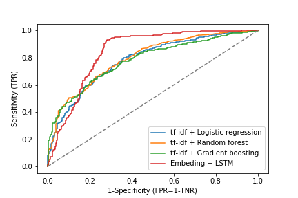

# Sentiment Analysis of prescription drugy reviews and key words of side effects extraction
## Motivation
- This is the first business project hold by Good Grug Medical, a startup data analysis company.  The dataset used in this project provides patient reviews on specific drugs along with related conditions and a 10 star patient rating reflecting overall patient satisfaction. The data was obtained by crawling online pharmaceutical review sites  (Druglib.com). 
- Sentiment Analysis of these reviews could be useful for pharmacy companies and doctors to quickly get into bad reviews and know patients' complains. Also, a lot of symptoms and drug sides were hiden under reviews, which will be great to be automatically extracted to improve the drug and help to give a better prescription. 
- We try to utilize this dataset to do data mining for patient behavior and drug effectiveness in order to provide useful information to patients, doctors and pharmacy companies.

## Target
- Find diseases with significantly seasonal variations based on dates of posting comments.  
- Train the model to predict sentiment of reviews as “Positive”, “Negative”, and “Neutral” based on vectorized words from patients’ comments.
- Explore side effects from patients’ comments.

## EDA
- The number of comments posted had a trend of increasing with time seires. The website probably became more popular after 2015. 

   

- The number of comments for each condition/disease was unbalanced. We had a extremely high number of comments for birth control.

   

### Find conditions/diseases with significantly seasonal variations
- The figour below showed the percentage of comments for the top 50 conditions with the most comments among 12 months. Several of them obviously presented some preference on distinct months, such as weight Loss and cough.	

   

- Chi-squared test was used to determine whether there is a significant difference between the expected frequency and the observed frequencies. The expected frequency here was assumed to be the frequency of all conditions/diseases among 12 months and the observed frequency of each condition was then compared to it. The resulting p-value was adjusted using fdr correction. 
 H0: The frequency of the condition/disease in 12 months have no difference with that the expected frequency.
 H1: The frequency of the condition/disease in 12 months have difference with that the expected frequency.  
  Top 10 conditions with lowest adjusted p-values

   |Condition|Statistic|p-value|adjusted p-value|
   |---|---|---|---|
   |Weight Loss|145.652500|1.149992e-25|9.297688e-24|
   |Cough|129.962039|1.771886e-22|7.162849e-21|
   |Allergic Rhinitis|89.940100|1.712822e-14|4.616054e-13|
   |Sinusitis|72.581047|3.936670e-11|7.956994e-10|
   |Cough and Nasal Congestion|71.094673|7.562344e-11|1.222831e-09|
   |Herpes Simplex|57.745517|2.424612e-08|3.267165e-07|
   |Obesity|54.759136|8.577515e-08|9.907030e-07|
   |Insomnia|53.858426|1.252668e-07|1.265978e-06|
   |Bronchitis|50.674949|4.731868e-07|4.250795e-06|
   |Vaginal Yeast Infection|48.344293|1.239355e-06|1.002018e-05|
   
- The figure below showed the frequencies of top 10 conditions with lowest adjusted p-values among 12 months, indicating obvious seasonalities.

   

## Identify comments with side effects
- It will also be very suggestive to drug pharmacy companies if I can build a model to filtering comments and quickly selecting patients' complains about side effects. However, the dataset used above didn't really contained the label of "with/without side effects". So web scraping is applied to extract comments and this type of labe from druglib.com, leading to total 4160 records. 

    

- tf-idf vecterization with Logistic regresssion, SVM, Random forest and Gradient boosting as well as embeding plus LSTM were applied to train data. LSTM here gave a highest performance about 84.3% accuracy, 9% higher than the seconde one, SVM with linear kernel (75.4%).

|   ROC curve             |  Model   | Accuracy | ROC-AUC|
|:-----------------------:|:-------------------------:|:-------------------------:|-------------------------:|
|  |  Logistic regresssion SVM linear SVM rbf Random forest   Gradient boosting  LSTM|0.73 0.75 0.68 0.71 0.72  0.86|0.78   -   -   0.79   0.77   0.84|

- Despite of the best performance, the model trained using LSTM is always hard to interpret. So we also looked into the second best model built by SVM using linear kernel. The figure below showed words with the top highest and lowest coefficients in the linear SVM model, which contributed to maximizing the margin and determining the boundary of two classes.

    

Top words in the linear SVM appeared to be related to description of some discomfort (e.g. "nausea", "dry", "diarrhea", "heartburn") dizzi"). However, these words could be ambiguous and included both symptoms and side effects, probably disturbing classification and resulting in a relatively lower performance. LSTM, as a special kind of RNN, is able to maintain some "memories" for forward/backworad words and likely to better "understand" the whole sentence. 
